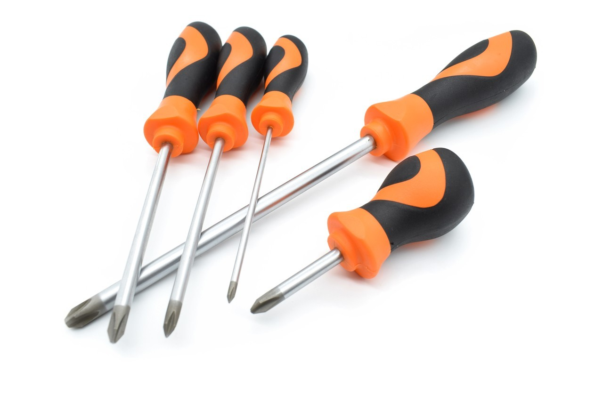
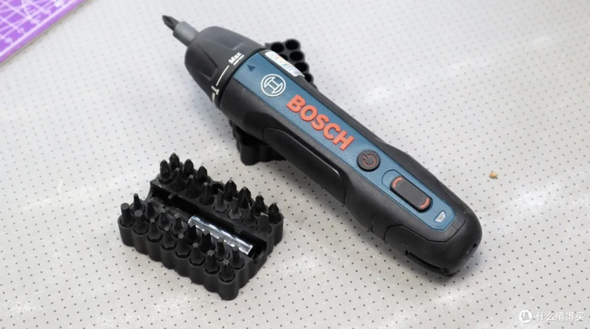
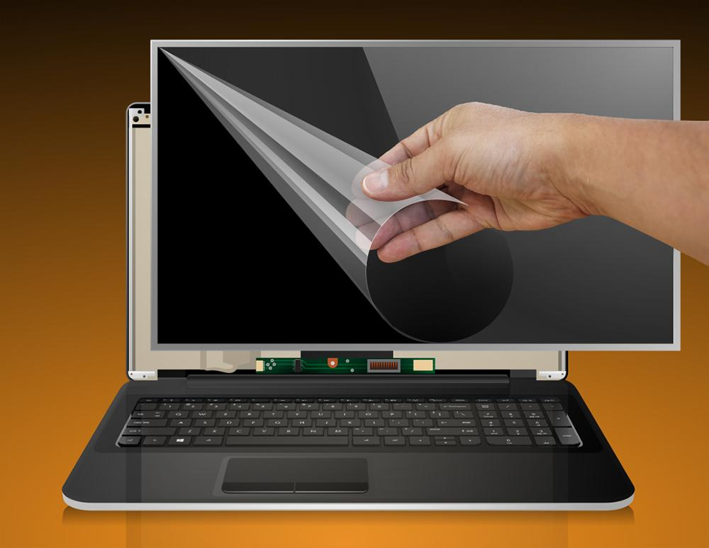
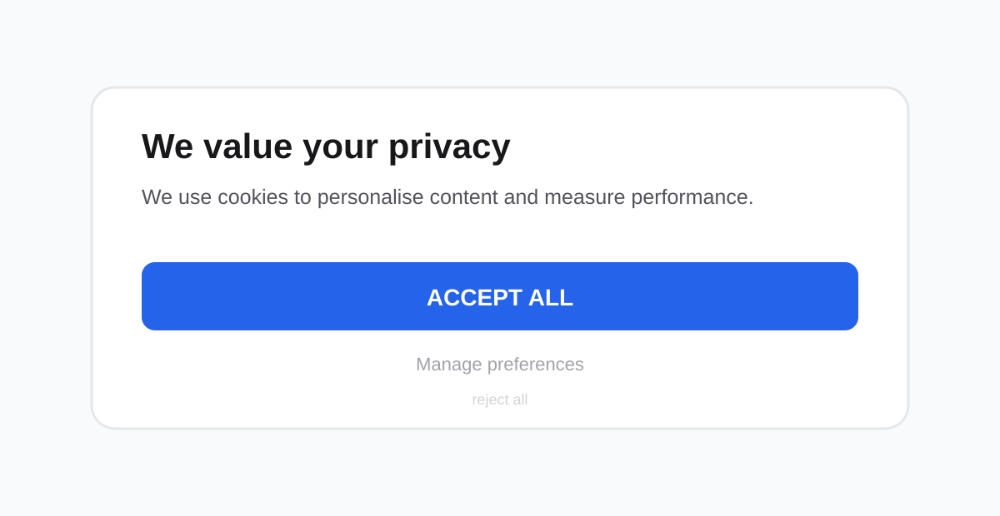
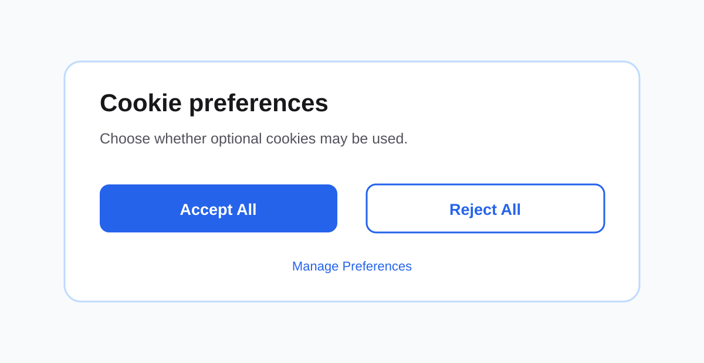
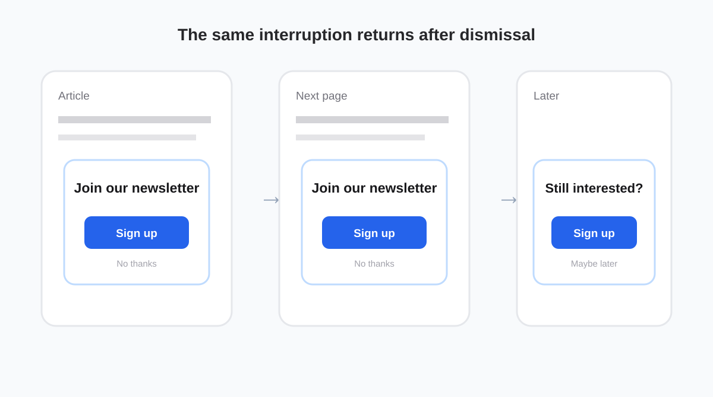

## Introduction

This homework explores three foundational topics in human-computer interaction: **affordances**, **Gestalt laws**, and **dark design patterns**. Rather than treating them only as definitions, I use everyday objects and digital interfaces to examine how design influences expectation, perception, and decision-making.

The goal is not simply to label a design as good or bad. The more useful question is whether the design communicates the intended action clearly, whether visual elements are organised in a way that matches the user's perception, and whether the interface supports the user's own goal instead of steering them toward another one.

## 1. Affordances

Affordance describes how the properties of an object suggest possible actions to a user. A clear affordance makes an interaction easy to infer before any instruction is read. A weak affordance creates uncertainty between what the user expects to happen and what the product actually requires.

### 1.1 Clear Affordance — Traditional Screwdriver

*Figure 1. Traditional screwdrivers provide strong visual and physical cues for grasping, aligning, and turning.*

The traditional screwdriver is a strong example of clear affordance because most of its intended use can be inferred directly from its physical form.

The enlarged handle invites the hand to **grasp** it. Its rounded and slightly contoured shape supports a stable grip and suggests that rotational force should be applied through twisting. The long metal shaft establishes an obvious axis between the hand and the screw, while the visible tip indicates where the tool should contact the screw head.

The mapping between action and result is also direct. When the user rotates the handle, the tip rotates by the same amount and in the same direction. There is no hidden operating mode between the user's movement and the mechanical result. This makes the interaction easy to understand even before the tool is used.

Different tip shapes provide another immediate visual cue about compatibility. A Phillips tip visually corresponds to a cross-shaped screw head, while a slotted tip corresponds to a straight slot. The tool therefore communicates both **where to hold it** and **where to apply it**.

**Why the affordance is clear:**

- The handle shape visibly and physically supports grasping.
- The shaft establishes a clear direction of use.
- The tip shape communicates compatibility with the screw head.
- Hand rotation maps directly to tip rotation.
- Mechanical resistance is felt immediately through the handle, providing continuous feedback.

### 1.2 Ambiguous Control Affordance — Electric Screwdriver

*Figure 2. The electric screwdriver preserves the basic screwdriver form, but its added controls make the detailed interaction less self-explanatory.*

The electric screwdriver is not a bad product overall. Its general purpose is still recognisable from the bit and handheld form. The weaker affordance appears in its **control interface**.

Several controls are placed along the same visual strip on the body. A round button uses a familiar power symbol, while a second elongated control uses curved markings related to rotation. For a first-time user, however, the relationship between these controls is not immediately obvious. It may be unclear whether the round button turns the device on, starts the motor, or changes a mode. The second control suggests direction, but the markings do not provide a strong spatial mapping to clockwise and counter-clockwise rotation.

The collar near the bit introduces another adjustable function. This is useful once the product is understood, but it adds another layer of interpretation before the basic interaction is fully clear. Compared with the manual screwdriver, more of the operating logic is hidden inside the device and must be learned from symbols or previous experience.

The problem is therefore not that an electric screwdriver is inherently a poor design. The problem is that **the individual roles of its controls are less obvious to a new user**.

**Why the affordance is weaker:**

- Multiple controls have similar visual importance even though they perform different functions.
- The primary start/stop action is less physically obvious than a trigger placed under the index finger.
- Rotation direction depends on interpreting symbols rather than an obvious physical mapping.
- Additional modes increase the amount of knowledge required before first use.
- A new user may need to experiment before understanding which control produces which result.

### 1.3 Redesign Proposal

I would keep the compact electric form but separate the main actions more clearly.

First, motor activation should be moved to an **index-finger trigger**. Its position would itself suggest pressing, and the user could activate the motor while maintaining a stable grip.

Second, forward and reverse should use a **two-sided thumb switch** marked with explicit clockwise and counter-clockwise arrows. The two directions should be physically separated so the control itself reflects the two possible rotational outcomes.

Third, torque or mode adjustment should remain near the front collar, but the settings should use clear detents and visible labels such as `1–5` and `MAX`. This separates continuous tool operation from occasional configuration.

Finally, the controls should differ in both **shape and position**, not only in printed symbols. A user should be able to distinguish the trigger, direction switch, and mode control by touch as well as by sight.

| Interaction | Traditional screwdriver | Current electric screwdriver | Proposed electric screwdriver |
| --- | --- | --- | --- |
| Start action | Grip and turn | Requires interpreting controls | Index-finger trigger |
| Direction | Directly follows hand rotation | Symbol-based control | Two-sided clockwise/counter-clockwise switch |
| Mode selection | None | Additional control near the front | Clearly labelled detented collar |
| Feedback | Direct mechanical resistance | Partly mediated by the motor | Motor response plus clear direction/mode indication |
| Learning required | Very low | Moderate for a first-time user | Reduced through physical mapping |

## 2. Gestalt Laws

Gestalt laws describe how people organise visual information into meaningful groups and structures. Instead of perceiving every visual element independently, users naturally infer relationships from proximity, similarity, enclosure, continuity, closure, and figure-ground separation.

The following two examples show situations where this automatic organisation can produce confusion because the visual design does not match the intended interpretation.

### 2.1 Figure–Ground — Removable Laptop Screen Film

*Figure 3. The transparent layer covers almost exactly the same area as the display, making the temporary film visually merge with the screen.*

This example illustrates a problem with the Gestalt principle of **figure–ground**.

A temporary transparent film can be placed over a laptop display during packaging or shipping. The film covers the same rectangular region as the screen, has very little colour contrast, and visually resembles a normal protective surface. Because of these similarities, the film may not initially be perceived as a separate foreground object.

The user can therefore interpret the film in two different ways: as temporary packaging that should be removed, or as a permanent protective layer that should remain on the screen. The lifted corner provides a peeling cue, but the rest of the transparent surface still visually merges with the display.

The design problem is therefore not simply that some users choose not to remove the film. The problem is that the visual separation between **temporary layer** and **actual screen** is weaker than it could be.

#### Correction

The temporary film should be visually separated from the display more clearly. Possible changes include:

- a coloured pull tab,
- a visible printed border,
- large text such as **“Remove before use”**,
- or a temporary pattern printed on the film.

These changes would make the film stand out as a separate figure instead of visually merging with the screen underneath.

### 2.2 Similarity and Figure–Ground — Canva Website Builder Landing Page

*Figure 4. The product demonstration contains controls that strongly resemble the real interactive controls of the surrounding page.*

The large product demonstration on this landing page is useful because it shows what the website editor looks like. However, it also creates a visual ambiguity.

Inside the demonstration are elements that look like real controls: **Preview**, **Publish Website**, **Share**, icons, a profile button, navigation tools, and a large **BOOK A TABLE** button. These elements use the same visual language as normal interactive web controls: borders, filled button backgrounds, icons, and labels.

This creates a **similarity** problem. Elements inside the static demonstration resemble elements that users normally expect to be clickable. At the same time, the demonstration occupies a large central region and is visually integrated into the landing page, which weakens the **figure–ground** distinction between the real website and the interface being demonstrated.

A user may therefore need a moment to determine which controls belong to the current page and which are only part of the product preview.

#### Correction

The demonstration could be made more clearly representational by:

- adding a small label such as **“Editor preview”**,
- placing the demonstration inside a stronger device/window frame,
- slightly reducing the contrast of controls inside the preview,
- or adding a subtle background separation between the live landing page and the example interface.

The goal is not to make the demonstration less attractive. It is to make the boundary between **interactive page** and **example interface** immediately clear.

## 3. Dark Design Patterns

Dark design patterns are interface strategies that steer users toward actions they may not otherwise choose. They exploit attention, hesitation, visual hierarchy, or persistence rather than supporting an equally clear and informed choice.

The two examples below use simplified reconstructions of common web patterns so that the design problem and the redesign can be compared directly.

### 3.1 Interface Interference — Unequal Cookie Choices

*Figure 5. A simplified reconstruction of interface interference: accepting all cookies is made visually dominant while rejecting is reduced to a low-emphasis text action.*

A common dark pattern appears in cookie consent banners. The **Accept All** action may be large, filled, and high-contrast, while **Reject All** is presented as a small text link or hidden behind additional settings.

This is a form of **interface interference** because the visual hierarchy privileges one decision over another. The website is still technically offering a choice, but the two options are not presented with equal salience or effort.

The problem is not the request for consent itself. The problem is that the interface makes the website's preferred outcome easier to notice and easier to select.

#### Redesign — Equal Choice

*Figure 6. Redesign: accepting and rejecting are presented at the same level, while detailed preferences remain available as a third option.*

The redesign gives **Accept All** and **Reject All** equal visual weight and keeps both actions on the first layer. **Manage Preferences** remains available without being used to hide the rejection path.

This changes the interaction from persuasion toward a particular answer to a clearer expression of user choice.

### 3.2 Nagging — Repeated Newsletter Pop-up

*Figure 7. A simplified reconstruction of nagging: the same sign-up request returns after the user has already dismissed it.*

Another common dark pattern is a newsletter or account sign-up prompt that repeatedly returns after the user has already dismissed it.

A single invitation is not necessarily problematic. The dark pattern appears when the interface does not respect the user's previous response and repeatedly interrupts the original task. The user's goal may be to read an article or browse information, while the system keeps redirecting attention toward registration or email capture.

This is **nagging** because the redirection persists across interactions. If the pop-up also blocks access to the underlying task until the user responds, it can additionally resemble **forced action**.

#### Redesign — Remember the User's Decision

*Figure 8. Redesign: the invitation is still available, but declining is clear and the choice is respected instead of repeatedly resurfacing.*

A user-respecting version should provide a visible **No thanks** option, remember the decision for a reasonable period, and avoid showing the same request again during the same session.

The objective is not to remove the website's ability to invite users to subscribe. It is to preserve the invitation without turning persistence into pressure.

## Conclusion

These examples show that usability depends not only on technical functionality, but also on how clearly a design communicates action, grouping, and intention.

The traditional screwdriver exposes most of its operating principle directly through physical form, while the electric screwdriver introduces useful functionality at the cost of additional interpretation. The laptop film and Canva landing page show how weak visual separation or excessive similarity can create perceptual ambiguity. Finally, the dark-pattern examples demonstrate how the same tools of visual hierarchy and interaction design can either support user autonomy or steer behaviour.

Across all three topics, the same lesson appears repeatedly: **good interaction design reduces unnecessary uncertainty and makes the user's options understandable without requiring extra interpretation or pressure.**
